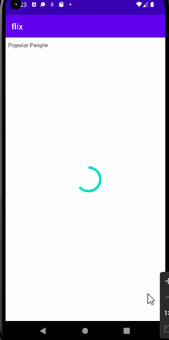

# Android Project 4 - *Flix*

Submitted by: **Joshua Barrientos**

**Name of your app** is a movie browsing app that allows users to browse popular celebrities and get info of a movie or TV show they are known for. 

Time spent: *15* hours spent in total

## Required Features

The following **required** functionality is completed:

- [x] **Choose any endpoint on The MovieDB API except `now_playing`**
  - Chosen Endpoint: person/popular
- [x] **Make a request to your chosen endpoint and implement a RecyclerView to display all entries**
- [x] **Use Glide to load and display at least one image per entry**
- [x] **Click on an entry to view specific details about that entry using Intents**

The following **optional** features are implemented:

- [ ] **Add another API call and RecyclerView that lets the user interact with different data.** 
- [ ] **Add rounded corners to the images using the Glide transformations**
- [ ] **Implement a shared element transition when user clicks into the details of a movie**

## Video Walkthrough

Here's a walkthrough of implemented user stories:

GIF created with [LiceCap](https://www.cockos.com/licecap/) 

## Notes

It was difficult to understand why some paths returned null, and how to work with data classes. 
It was also hard to figure out how to work with information that was in a nested JSon object.
## License

    Copyright [2022] [Joshua Barrientos]

    Licensed under the Apache License, Version 2.0 (the "License");
    you may not use this file except in compliance with the License.
    You may obtain a copy of the License at

        http://www.apache.org/licenses/LICENSE-2.0

    Unless required by applicable law or agreed to in writing, software
    distributed under the License is distributed on an "AS IS" BASIS,
    WITHOUT WARRANTIES OR CONDITIONS OF ANY KIND, either express or implied.
    See the License for the specific language governing permissions and
    limitations under the License.
